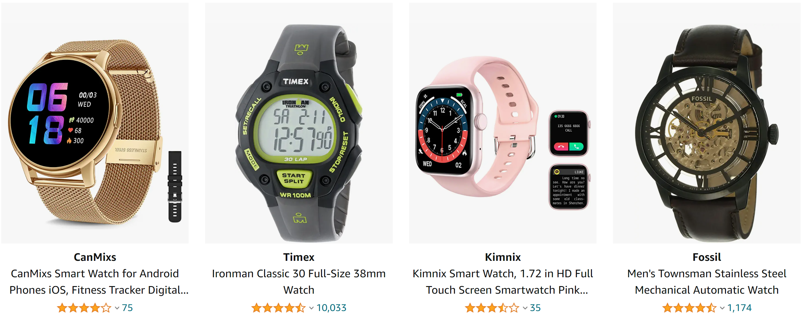

# Amazon Vine Analysis

  <a href="#">Amazon Watches</a>
     
  

  
## Table of Contents
* [Overview](https://github.com/rkaysen63/Amazon_Vine_Analysis/blob/master/README.md#overview)
* [Resources](https://github.com/rkaysen63/Amazon_Vine_Analysis/blob/master/README.md#resources)
* [Results](https://github.com/rkaysen63/Amazon_Vine_Analysis/blob/master/README.md#results)
* [Summary](https://github.com/rkaysen63/Amazon_Vine_Analysis/blob/master/README.md#summary)

## Resources:    
* Data: https://s3.amazonaws.com/amazon-reviews-pds/tsv/amazon_reviews_us_Watches_v1_00.tsv.gz
* Tools: 
  * Python
  * Colaboratory (Colab) notebook for writing code
  * PostgreSQL database engine
  * pgAdmin platform to set up database tables and query data
  * AWS Console for big data management
  * Apache Spark to perform ETL on big data
* Screen shot of watches from https://www.amazon.com/s?k=watches&ref=nb_sb_noss_1
* Lesson Plan: UTA-VIRT-DATA-PT-02-2021-U-B-TTH, Module 16 Challenge

## Overview:
The Amazon Vine program uses Vine Voices to provide customers unbiased reviews of Amazon products.  Vine Voices are customers that are invited to join the program based on their reviewer rank.  The Vine members receive free products from Amazon that are provided by participating vendors, but vendors cannot influence, modify or edit the reviews.  More about Amazon Vine is available at https://www.amazon.com/gp/vine/help.

Amazon's review datasets (https://s3.amazonaws.com/amazon-reviews-pds/tsv/index.txt) are organized by product category. The "Watches" dataset was selected for this analysis that proposes to determine if Amazon Vine members provide more favorable reviews than non-Vine members.

## Results:
### ETL

* **Extract:** 

  <a href="#">Extract Amazon Review Dataset, "Watches", as a Dataframe</a>
     
  

    

* **Transform:** 
  Transform the dataframe extracted from Amazon into four dataframes: **customers_df, products_df, review_id_df, vine_df**      
  

  <a href="#">customers_df</a>
     
  
     
  <a href="#">products_df</a>
     
  
    
  <a href="#">review_id_df</a>
       
  
     
  <a href="#">vine_df</a>
     
    

   

* **Load:** 
  Load four dataframes into respective tables in pgAdmin:  **customers_table, products_table, review_id_table, vine_table**    

   <a href="#">schema</a>
     
  
       
  <a href="#">customers_table</a>
     
  
     
  <a href="#">products_table</a>
     
  
    
  <a href="#">review_id_table</a>
       
  
     
  <a href="#">vine_table</a>
     
    

    

### Determine Bias of Vine Reviews
* There is a DataFrame or table for the vine_table data using one of three methods above (5 pt)
* The data is filtered to create a DataFrame or table where there are 20 or more total votes (5 pt)
* The data is filtered to create a DataFrame or table where the percentage of helpful_votes is equal to or greater than 50% (5 pt)
* The data is filtered to create a DataFrame or table where there is a Vine review (5 pt)
* The data is filtered to create a DataFrame or table where there isn’t a Vine review (5 pt)
* The total number of reviews, the number of 5-star reviews, and the percentage 5-star reviews are calculated for all Vine and non-Vine reviews (15 pt)

### Analysis of Vine Reviews
Results: Using bulleted lists and images of DataFrames as support, address the following questions:

How many Vine reviews and non-Vine reviews were there?
How many Vine reviews were 5 stars? How many non-Vine reviews were 5 stars?
What percentage of Vine reviews were 5 stars? What percentage of non-Vine reviews were 5 stars?

## Summary:

Summary: In your summary, state if there is any positivity bias for reviews in the Vine program. Use the results of your analysis to support your statement. Then, provide one additional analysis that you could do with the dataset to support your statement.

[Back to the Table of Contents](https://github.com/rkaysen63/Amazon_Vine_Analysis/blob/master/README.md#table-of-contents)
