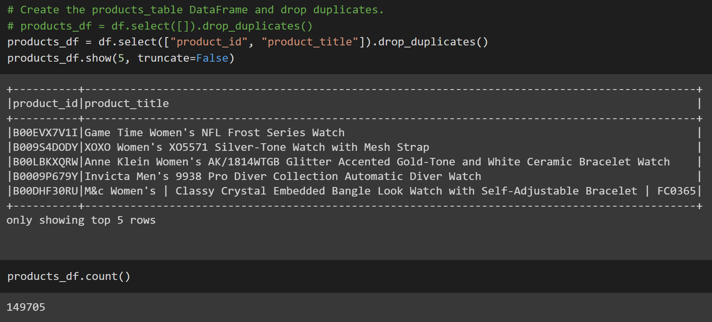

# Amazon Vine Analysis

  <a href="#">Amazon Watches</a>
     
  

  
## Table of Contents
* [Overview](https://github.com/rkaysen63/Amazon_Vine_Analysis/blob/master/README.md#overview)
* [Resources](https://github.com/rkaysen63/Amazon_Vine_Analysis/blob/master/README.md#resources)
* [Results](https://github.com/rkaysen63/Amazon_Vine_Analysis/blob/master/README.md#results)
* [Summary](https://github.com/rkaysen63/Amazon_Vine_Analysis/blob/master/README.md#summary)

## Resources:    
* Data: https://s3.amazonaws.com/amazon-reviews-pds/tsv/amazon_reviews_us_Watches_v1_00.tsv.gz
* Tools: 
  * Python
  * Colaboratory (Colab) notebook for writing code
  * PostgreSQL database engine
  * pgAdmin platform to set up database tables and query data
  * AWS Console for big data management
  * Apache Spark to perform ETL on big data
* Screen shot of watches from https://www.amazon.com/s?k=watches&ref=nb_sb_noss_1
* Lesson Plan: UTA-VIRT-DATA-PT-02-2021-U-B-TTH, Module 16 Challenge

## Overview:
The Amazon Vine program uses Vine Voices to provide customers unbiased reviews of Amazon products.  Vine Voices are customers that are invited to join the program based on their reviewer rank.  The Vine members receive free products from Amazon that are provided by participating vendors, but vendors cannot influence, modify or edit the reviews.  More about Amazon Vine is available at https://www.amazon.com/gp/vine/help.

Amazon's review datasets (https://s3.amazonaws.com/amazon-reviews-pds/tsv/index.txt) are organized by product category. The "Watches" dataset was selected for this analysis that proposes to determine if Amazon Vine members provide more favorable reviews than non-Vine members.

## Results:
### ETL

* **Extract:** 

  <a href="#">Extract Amazon Review Dataset, "Watches", as a Dataframe (df)</a>
     
  

    

* **Transform:** 
  Transform df into four dataframes: **customers_df, products_df, review_id_df, vine_df**      
  

  <a href="#">customers_df</a>
     
  
     
  <a href="#">products_df</a>
     
  
    
  <a href="#">review_id_df</a>
       
  
     
  <a href="#">vine_df</a>
     
    

   

* **Load:** 
  Load the four dataframes into respective tables in pgAdmin:  **customers_table, products_table, review_id_table, vine_table**    

   <a href="#">schema</a>
     
  
       
  <a href="#">customers_table</a>
     
  
     
  <a href="#">products_table</a>
     
  
    
  <a href="#">review_id_table</a>
       
  
     
  <a href="#">vine_table</a>
     
    

    

### Determine Bias of Vine Reviews

  <a href="#">DataFrame (vine_df) created by transforming a dataframe (df) that was extracted from an Amazon Reviews dataset for Watches</a>
     
    

    

  <a href="#">DataFrame (df_reviews20) created from vine_df where there are 20 or more total votes</a>
     
    

  

  <a href="#">Dataframe (df_helpful) created from df_reviews20 where the percentage of helpful_votes is equal to or greater than 50%</a>
     
    

 

  <a href="#">Dataframe (vine_Y_df) that only includes Vine reviews</a>
     
    

 

  <a href="#">Dataframe (vine_N_df) that only includes non-Vine reviews</a>
     
    

 

  <a href="#">Pecentage of 5-Star reviews of total Vine reviews.</a>
     
  
     
  <a href="#">Pecentage of 5-Star reviews of total non-Vine reviews.</a>
     
    

 

### Analysis of Vine Reviews

* Number of Reviews
  * There are 47 Vine reviews.
  * There are 8326 non-Vine reviews.

* 5-Star Reviews
  * Of the 47 Vine reviews, 15 received 5 stars.
  * Of the 8326 non-Vine reviews, 4321 received 5 stars.

* Percentage of 5-Star Reviews
  * 32% of the Vine reviews received 5 stars.
  * 52% of the non-Vine reviews received 5 stars.

## Summary:

Summary: In your summary, state if there is any positivity bias for reviews in the Vine program. Use the results of your analysis to support your statement. Then, provide one additional analysis that you could do with the dataset to support your statement.

[Back to the Table of Contents](https://github.com/rkaysen63/Amazon_Vine_Analysis/blob/master/README.md#table-of-contents)
